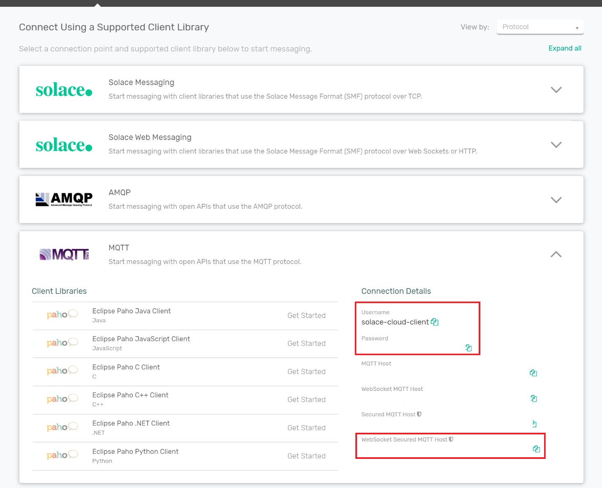

# linking-vuex-stores


This is a very simplistic example of using Solace PubSub+ in your Vue Application to allow for communication between two different VuEx stores.

## Project setup

```
npm install
```

## Sign up for a Solace PubSub+ Cloud Account

Use the following [link](https://docs.solace.com/Solace-Cloud/ggs_signup.htm) as a guide to sign up for a [FREE](https://console.solace.cloud/login/new-account) Solace PubSub+ Cloud instance ane make note of the credentials and 'Websocket Secure MQTT Host' from the MQTT section of the 'Connect' tab:


Make a copy of src/common/solace-credentials-template.js to src/common/solace-credentials.js and fill in the

```
export var SolaceCredentials = {
  hostUrl: '',
  username: '',
  password: ''
}
```

with the host, username and password that you retrieved above.

### Running the appplication

```
npm run serve
```

Navigate to http://localhost:8080 (or whatever port you get from running the command above).

This is your Player1 screen.

Navigate to http://localhost:8080/?player=Player2

This would be your Player2 screen.

Provided everything has been succesfully setup, you should be presented with two screens as below and you can now communicate between your two different VuEx Stores!


